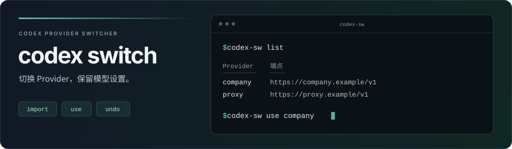

# codex switch



[](https://github.com/Chlience/codex-switch/actions/workflows/ci.yml)
[](Cargo.toml)
[](.github/workflows/ci.yml)

**一条命令切换 Codex Provider，保留模型与推理设置。**

`codex-sw` 是跨平台的 Codex Provider 切换器。导入已有配置，按 Provider ID 选择端点与认证方式；支持切换预览、撤销和中断恢复。

[安装](#安装) · [快速开始](#快速开始) · [添加与导入](#添加与导入) · [命令速查](#命令速查) · [使用说明](#使用说明) · [开发与验证](#开发与验证)

## 功能

| 能力 | 行为 |
| --- | --- |
| **按 ID 选择** | 使用配置中的 ID；列表展示 Provider 和端点 |
| **保留模型** | 切换地址与认证配置，保留模型、推理强度和其他运行参数 |
| **配置导入** | 读取已有配置，或依次粘贴 TOML 与 `auth.json` |
| **认证方式** | 支持原生认证文件、环境变量、直接 token 和外部凭据存储引用 |
| **预览恢复** | 写入前预览；通过事务记录支持撤销和中断恢复 |
| **跨平台** | Linux、macOS、Windows；所有命令支持 JSON 输出 |

## 安装

### 从源码安装

需要 Git 和 **Rust 1.89 或更新版本**：

```sh
git clone https://github.com/Chlience/codex-switch.git
cd codex-switch
cargo install --path . --locked
codex-sw --help
```

### 使用构建产物

[GitHub Actions](https://github.com/Chlience/codex-switch/actions/workflows/ci.yml) 的成功运行会提供各平台构建产物。在运行详情的 **Artifacts** 中下载对应平台与架构的文件，将其中的 `codex-sw` 或 `codex-sw.exe` 放入 `PATH` 目录。

Linux/macOS 如需补充执行权限，运行 `chmod +x codex-sw`。运行已编译的二进制不需要 Rust、Node.js 或 Python。构建产物以工作流实际提供的文件为准。

## 快速开始

先准备好已有 Codex 配置，以及需要导入的另一份 `config.toml`。以下示例使用其中的 Provider ID `company`。

**1. 保存当前配置，导入另一个 Provider。**

```sh
codex-sw import
codex-sw import --from /path/to/config.toml --provider company
```

**2. 查看已保存的 Provider。**

```sh
codex-sw list
```

示例输出：

```text
Provider  端点
────────  ────
company   https://company.example/v1
proxy     https://proxy.example/v1
```

**3. 预览并切换。**

> [!IMPORTANT]
> 切换后，已有 Codex 实例需要重启才能使用新配置。工具固定显示重启提示，不扫描进程或输出 PID。既有会话不会自动切换 Provider；并行会话还需注意[认证隔离限制](#会话与认证边界)。

```sh
codex-sw use company --dry-run
codex-sw use company
codex-sw current
```

需要撤销最近一次切换时，运行 `codex-sw undo`；检查本地配置和凭据依赖时，运行 `codex-sw doctor`。

## 添加与导入

### 粘贴配置添加

运行 `codex-sw add`，按提示依次粘贴下面两段内容。**每段都以独立的一行 `END` 结束。**

第一段是 Provider 的 TOML 配置：

```toml
[model_providers.company]
name = "Company gateway"
base_url = "https://company.example/v1"
wire_api = "responses"
```

第二段是完整的 `auth.json`，例如：

```json
{"OPENAI_API_KEY": "your-api-key"}
```

保存后使用 `codex-sw use company` 激活。这里的 **`company` 是 Provider ID**，来自 `[model_providers.company]`；`name` 是 Codex 配置中的显示名称。

工具也接受完整 `config.toml`；包含多个 Provider 时，用顶层 `model_provider` 指定所选 ID。输入通过校验后自动保存，无需额外确认。

<details>
<summary>交互输入与认证要求</summary>

- 工具在接收 `auth.json` 前检查 ID 是否重复，保存时在文件锁内再次检查。
- 自定义 Provider 会自动设置 `requires_openai_auth = true`。如配置包含 `env_key`、`experimental_bearer_token` 或认证命令，先移除这些认证字段再粘贴。
- 两段输入均支持空行和多行，每段最多 1 MiB，结束标记不计入大小。读取到 EOF 或中途退出时，不保存未完成的记录。
- `auth.json` 保留原始字节和未知字段；模型及其他运行参数不进入保存的 Provider 配置。
- 提示写入 stderr，`add --json` 的保存结果写入 stdout。结果和错误消息不包含粘贴的凭据内容。

</details>

### 使用环境变量认证

先在将要运行 Codex 的环境中设置 `WORK_API_KEY`，再添加并切换：

```sh
codex-sw add work --base-url https://provider.example/v1 --env-key WORK_API_KEY
codex-sw use work
```

工具只保存变量名称，不复制变量中的密钥，也不能修改调用它的父 shell 环境。

### 从已有配置导入

| 场景 | 命令 |
| --- | --- |
| 保存当前默认 Provider | `codex-sw import` |
| 选择配置中的某个 Provider | `codex-sw import --provider company` |
| 从指定配置文件导入 | `codex-sw import --from /path/to/config.toml --provider company` |
| 导入所有 Provider | `codex-sw import --all` |
| 导入独立或旧版 profile | `codex-sw import --profile work` |
| 显式关联原生认证文件 | `codex-sw import --provider company --auth-file /path/to/auth.json` |
| 预览导入结果 | `codex-sw import --all --dry-run` |

导入只保存记录，不激活 Provider。`--all` 仅为当前 Provider 自动关联原生认证文件；使用 `--auth-file` 时，所选 Provider 须已配置为使用原生认证。每个 ID 只登记一条配置与认证记录：相同内容再次导入会跳过，内容不同则报错并保留原记录。

<details>
<summary>其他认证方式</summary>

| 认证方式 | 添加或导入方式 |
| --- | --- |
| 原生 `auth.json` | `codex-sw add company --base-url https://company.example/v1 --auth-file /path/to/auth.json` |
| 直接 token | `codex-sw add company --base-url https://company.example/v1 --bearer-token-stdin`，从标准输入传入 token |
| 已有直接 token | `import` 保留 `experimental_bearer_token` |
| 现有官方文件登录 | `codex-sw add openai`，继续使用现有文件认证 |
| 外部凭据存储 | 导入时保留 `keyring`、`auto`、`ephemeral`，不导出或验证其中的凭据 |
| 认证命令 | 导入时保留配置；导入和诊断均不执行命令 |

`--bearer-token-stdin`、`--env-key` 和 `--auth-file` 互斥。空 token 或缺失的必要环境变量会阻止激活；导入可以保留有问题的配置并报告待修正项。

</details>

## 命令速查

| 命令 | 用途 |
| --- | --- |
| `codex-sw add` | 交互式添加 Provider |
| `codex-sw add <provider> ...` | 通过参数添加 Provider |
| `codex-sw import` | 导入当前默认 Provider |
| `codex-sw list` | 查看 Provider 与保存的端点 |
| `codex-sw use <provider>` | 切换默认 Provider |
| `codex-sw use <provider> --dry-run` | 预览切换，不写入文件 |
| `codex-sw current` | 查看用户配置中的默认 Provider 与模型 |
| `codex-sw doctor` | 离线检查配置与凭据依赖 |
| `codex-sw undo` | 撤销最近一次切换；外部修改或凭据刷新后拒绝覆盖 |
| `codex-sw recover` | 恢复中断事务；保留外部修改的文件 |
| `codex-sw remove <provider>` | 移除未使用的登记；凭据和历史备份保留 |

默认读取 `CODEX_HOME`；未设置时使用用户主目录下的 `.codex`。所有命令均支持 `--codex-home <directory>` 和 `--json`，JSON 写入 stdout，提示和警告写入 stderr。

```sh
codex-sw --codex-home /path/to/codex list
codex-sw list --json
codex-sw use --help
```

## 使用说明

### Provider ID 与端点

所有选择操作使用 `[model_providers.<id>]` 中的 ID；内置 Provider 使用固定 ID，例如 `openai`。ID 区分大小写，支持中文，不能为空或包含控制字符。需要保留多个端点或账号时，使用不同的 ID。`add` 拒绝已有 ID。

`list` 展示的是保存的配置；环境变量、启动参数和项目配置仍可能影响运行中的实际地址。

| 保存的地址配置 | 列表显示 |
| --- | --- |
| 自定义 Provider 的 `base_url` | 对应端点 |
| 内置 `openai` 的 `openai_base_url` | 对应端点 |
| 内置 Provider 未保存显式地址 | `Codex 默认` |
| 自定义 Provider 未保存地址 | `未配置` |

端点 URL 中的用户名、密码、查询参数和片段会隐藏，JSON 的 `endpoint` 同样经过处理；未保存地址时返回 `null`。

### 配置管理

切换只更新 Provider 地址及认证设置，保留当前模型、推理强度和其他运行参数。`add` 不接受 `--model` 参数。

执行 `use` 时，写入的 Provider 定义带有管理注释，各配置块之间保留空行：

```toml
# 手动维护的 Provider
[model_providers.personal]
name = "Personal"
base_url = "https://personal.example/v1"

# Managed by codex-sw
[model_providers.company]
name = "Company gateway"
base_url = "https://company.example/v1"
```

已有用户注释会保留，重复切换不会累积管理注释或空行。`add` 和 `import` 不修改源配置；`undo` 恢复切换前的配置文本。

<details>
<summary>配置修改范围与旧记录兼容</summary>

导入只提取 `model_provider`、`openai_base_url`、所选 `model_providers.<id>` 定义及相关认证方式。切换时整体恢复所选 Provider 定义，`openai_base_url` 以保存记录为准，记录未设置时清除。

模型、推理强度、上下文窗口、模型目录、`service_tier`、MCP、沙盒、项目授权等设置保持当前值，包括未设置状态。工具保留无关注释；已有 `config.toml` 软链会保留，并编辑实际目标。行内和点分写法的 Provider 会整理为独立配置块，配置值保持不变；内置 Provider 没有自定义定义时，不创建配置块。

独立预设别名已取消。旧别名 `original` 指向 `proxy` 时，使用 `codex-sw use proxy`。旧文件名、认证软链和事务索引保持有效，无需迁移凭据。若同一 ID 对应多条旧记录，选择、导入或删除时会报告冲突，要求先整理重复登记。

旧记录中的模型参数会被忽略，不再参与切换、记录匹配或重复导入判断；仅模型参数变化仍视为相同记录。工具不会自动重写旧记录文件。`list` 不包含模型，`current` 仍显示实际默认模型。

JSON 接口中，`list` 不再返回 `name`，`use` 使用 `provider` 字段，`current` 通过 `matches_saved` 表示当前配置和认证是否匹配保存记录。`use` 和 `doctor` 不再包含 `active_instances`。

导入旧 profile 不改写源文件。若当前 `config.toml` 仍有旧顶层 `profile` 选择器，需要先按 Codex 官方指引迁移。CLI 参数、独立 profile、项目与管理配置仍可能覆盖用户默认值，`current` 不表示运行中会话的完整配置。

</details>

<details>
<summary>认证文件、目录结构与事务恢复</summary>

原生 `auth.json` 按完整字节保存，保留 `auth_mode`、tokens 和未知字段。直接 token、固定请求头和认证命令保存在私有 Provider 记录中；环境变量凭据保存变量引用。**凭据及备份使用受文件权限保护的明文存储，不提供加密。**

`env_key` 和 `env_http_headers` 保留环境变量引用。切换时检查所需变量，环境请求头对应的变量缺失时会提示。

切换时通过 `--auth-mode` 指定 `auto`、`symlink` 或 `copy`，选择原生认证文件的激活方式。其中 `auto` 为默认值：

| 平台 | `auto` 行为 |
| --- | --- |
| Linux / macOS | 使用相对软链 |
| Windows | 使用文件复制 |

Windows 手动选择 `symlink` 时可能需要开发者模式或相应权限。复制模式会在后续切换前回存相同身份的最新凭据；检测到身份变化时，要求重新导入，避免覆盖旧记录。

```text
CODEX_HOME/
├── config.toml
├── auth.json → codex-sw/credentials/auth.json.company  # 软链模式
└── codex-sw/
    ├── providers/<storage-key>.json
    ├── credentials/auth.json.<storage-key>
    ├── state.json
    ├── lock
    ├── pending.json           # 仅在事务进行中或中断时存在
    ├── undo.json
    └── history/<transaction>.json
```

文件写入使用同目录临时文件及替换，工具实例之间使用文件锁。跨文件修改先保存事务日志，异常后通过 `recover` 恢复。已完成事务保存在私有 `history` 中，不自动清理。Unix 管理目录权限为 0700，管理文件为 0600；Windows 使用当前用户 SID 的受保护 DACL。备份同样包含敏感内容。

切换成功、撤销成功或实际恢复事务后，固定提示已有 Codex 实例需要重启。预览、诊断、失败操作及无待恢复事务时不提示重启。

</details>

### 会话与认证边界

> [!WARNING]
> 多个 Codex 实例共享 `auth.json` 时，旧实例的 OAuth 刷新可能将旧账号的 token 写入切换后的记录。软链和复制模式均受影响。文件锁与事务日志不提供会话间的认证隔离；切换时请重启已有实例。

该行为已在 Codex 0.156.1 上复现，详见[验证记录](docs/validation.md)。工具只提醒重启，不等待或阻止切换。不同账号的并行会话、独立 `CODEX_HOME` 启动器和后台代理不在当前功能范围内。

登出可能删除 `auth.json` 链接，OAuth 登出还可能撤销远端凭据；保留的凭据文件不代表仍然有效。`doctor` 仅检查本地结构，不验证真实服务的 token 有效性。不同 Codex 版本的认证优先级可能变化，工具保留原始认证组合。

## 开发与验证

在仓库目录运行：

```sh
cargo fmt --check
cargo clippy --locked --all-targets -- -D warnings
cargo test --locked
cargo build --locked --release
```

已安装 Windows MSVC 目标时，可额外执行编译检查：

```sh
cargo check --locked --all-targets --target x86_64-pc-windows-msvc
```

测试使用临时目录与虚构凭据，覆盖 Provider 选择、模型参数保留、认证方式、固定重启提示、撤销和事务恢复。[CI 工作流](.github/workflows/ci.yml) 配置了 Linux、macOS、Windows 测试与构建矩阵；本机交叉编译不能替代原生运行时验证。

具体的本机检查结果、Codex 兼容性实验及未验证范围见[验证记录](docs/validation.md)。
